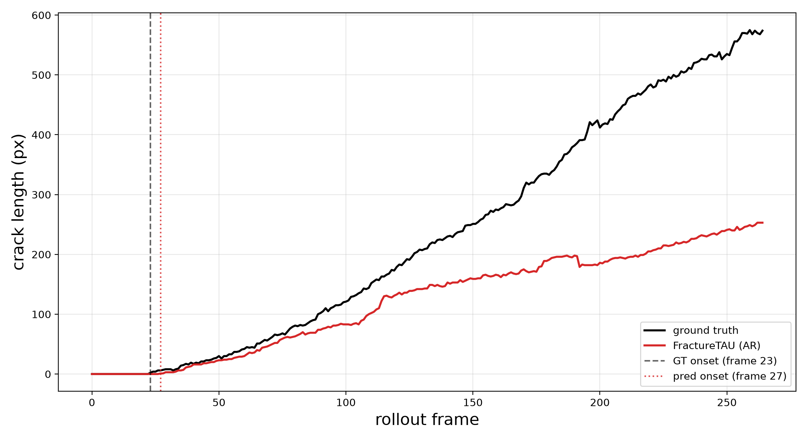
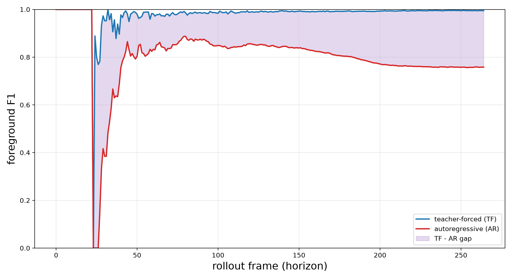
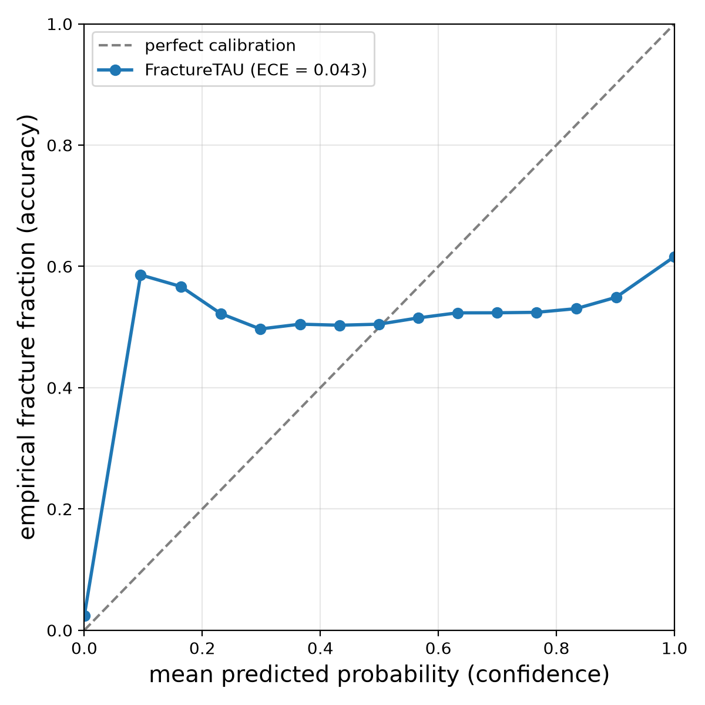

# FractureTAU Physical-Metrics Report -- tau_refined

Static, git-diffable physical-fidelity report (D-13). Regenerate with `python results/phys_metrics/make_phys_report.py --run-name tau_refined`. Every reported number traces to a measured artifact (correctness-over-convenience mandate).

## 1. Headline result (3-seed mean +/- std + significance)

_not yet available: seed aggregation failed -- [seed] missing checkpoint for provenance: /home/jicanta/Desktop/trabajo/surf-purdue-2026/dynamic-fracture/archive/v1.0/outputs/headline_s42/checkpoints/best.pt_

## 2. Boundary metrics (HD95 + boundary-F1)

Crack-front localization on the binarized (no-healing) AR prediction vs GT, per D-03: **HD95** (reviewer-familiar 95th-pct Hausdorff; empty-mask -> NaN, excluded from the mean) and **boundary-F1** (BF score within 2 px). Per-frame metrics are averaged within each case.

| Case | mean HD95 (px) | mean boundary-F1 |
|---|---:|---:|
| test_MS206_V100 | NaN | 0.2746 |
| test_MS206_V1000 | 2.558 | 0.9656 |
| test_MS206_V200 | 1.813 | 0.9440 |
| test_MS206_V400 | 31.543 | 0.9265 |
| test_MS210_V400 | 58.613 | 0.6747 |
| test_MS5_V150ms_inc | 4.529 | 0.7976 |
| test_MS5_V400ms | 7.234 | 0.8918 |
| test_PBX1_V400_true | 111.173 | 0.0865 |
| test_PBX_2_V400 | 70.247 | 0.1530 |
| test_emergency_horizontal | 50.350 | 0.7630 |
| test_horizontal_layers_3 | 11.404 | 0.8834 |
| test_horizontal_layers_4 | 7.260 | 0.9234 |
| test_inclusions_1_2 | 16.100 | 0.6733 |
| test_inclusions_2_2 | 13.464 | 0.6361 |
| test_inclusions_3_2 | 84.188 | 0.1891 |
| test_inclusions_true_V400 | 123.297 | 0.2301 |
| **MACRO (over 16 cases)** | **39.585** | **0.6258** |

## 3. Physical metrics (crack length-over-time + onset)

Crack length = skeleton-pixel count per frame (reported in PIXELS; pixel-pitch left at 1.0 -- A3 honesty); time-to-onset = first frame with any predicted crack. GT vs FractureTAU (AR). The length-over-time figure below is the representative case (median macro F1).

| Case | onset (GT) | onset (pred) | final length GT (px) | final length pred (px) |
|---|---:|---:|---:|---:|
| test_MS206_V100 | 81 | -1 | 15.0 | 0.0 |
| test_MS206_V1000 | 1 | 4 | 652.0 | 596.0 |
| test_MS206_V200 | 28 | 36 | 77.0 | 57.0 |
| test_MS206_V400 | 10 | 13 | 304.0 | 193.0 |
| test_MS210_V400 | 3 | 9 | 585.0 | 177.0 |
| test_MS5_V150ms_inc | 170 | 218 | 49.0 | 34.0 |
| test_MS5_V400ms | 25 | 31 | 573.0 | 455.0 |
| test_PBX1_V400_true | 23 | 0 | 1144.0 | 784.0 |
| test_PBX_2_V400 | 3 | 0 | 2330.0 | 810.0 |
| test_emergency_horizontal | 23 | 27 | 574.0 | 253.0 |
| test_horizontal_layers_3 | 23 | 24 | 406.0 | 270.0 |
| test_horizontal_layers_4 | 24 | 25 | 435.0 | 305.0 |
| test_inclusions_1_2 | 4 | 7 | 559.0 | 287.0 |
| test_inclusions_2_2 | 4 | 10 | 644.0 | 389.0 |
| test_inclusions_3_2 | 4 | 0 | 610.0 | 470.0 |
| test_inclusions_true_V400 | 4 | 0 | 305.0 | 499.0 |

## 4. Error accumulation (teacher-forced vs autoregressive F1)

Per-frame F1 gap `TF - AR` over the rollout horizon (D-13 fidelity evidence): how far the autoregressive rollout drifts from the teacher-forced pass as the horizon grows. Computed from the REAL `per_frame_metrics_tf.csv` (D-14 teacher-forced pass, inference-only / freeze-legal) against the AR `per_frame_metrics.csv`, reusing the D-03 F1 (never the stored `f1` column, S4).

| Case | mean gap (TF-AR) | late-rollout gap (last 20%) |
|---|---:|---:|
| test_MS206_V100 | +0.7136 | +0.9942 |
| test_MS206_V1000 | +0.0508 | +0.0289 |
| test_MS206_V200 | +0.0963 | +0.0876 |
| test_MS206_V400 | +0.0751 | +0.1072 |
| test_MS210_V400 | +0.2774 | +0.4073 |
| test_MS5_V150ms_inc | +0.2126 | +0.1841 |
| test_MS5_V400ms | +0.1274 | +0.1074 |
| test_PBX1_V400_true | +0.7112 | +0.8061 |
| test_PBX_2_V400 | +0.6713 | +0.5787 |
| test_emergency_horizontal | +0.1808 | +0.2356 |
| test_horizontal_layers_3 | +0.0996 | +0.1190 |
| test_horizontal_layers_4 | +0.0833 | +0.0784 |
| test_inclusions_1_2 | +0.2439 | +0.2468 |
| test_inclusions_2_2 | +0.1767 | +0.1886 |
| test_inclusions_3_2 | +0.5031 | +0.3959 |
| test_inclusions_true_V400 | +0.6385 | +0.5607 |

## 5. Calibration (reliability + ECE)

Reliability of the raw predicted probabilities over the rollout, binned by PREDICTED PROBABILITY (never a binarized mask, Pitfall 5). ECE per case + an aggregate reliability diagram over all cases.

| Case | ECE |
|---|---:|
| test_MS206_V100 | 0.0012 |
| test_MS206_V1000 | 0.0039 |
| test_MS206_V200 | 0.0009 |
| test_MS206_V400 | 0.0034 |
| test_MS210_V400 | 0.0191 |
| test_MS5_V150ms_inc | 0.0004 |
| test_MS5_V400ms | 0.0087 |
| test_PBX1_V400_true | 0.1496 |
| test_PBX_2_V400 | 0.2807 |
| test_emergency_horizontal | 0.0155 |
| test_horizontal_layers_3 | 0.0078 |
| test_horizontal_layers_4 | 0.0056 |
| test_inclusions_1_2 | 0.0235 |
| test_inclusions_2_2 | 0.0297 |
| test_inclusions_3_2 | 0.1188 |
| test_inclusions_true_V400 | 0.0848 |

Aggregate ECE over 16 cases: **0.0435**.

## 6. Rollout stability

Per-case foreground-F1 curves resampled onto a common normalized rollout fraction [0,1] grid; band = median + IQR (25-75%) across cases (reused from `dashboard.plots.stability_band`, S4).

## 7. Compute efficiency (params / MACs / FLOPs / A100-h)

_not yet available: no `checkpoints/best.pt` under tau_refined._

