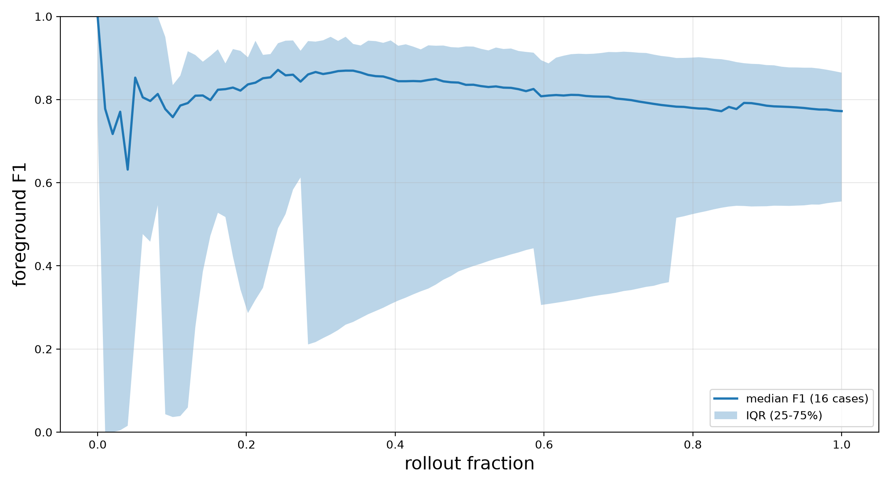
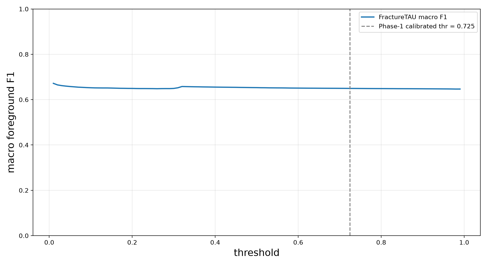
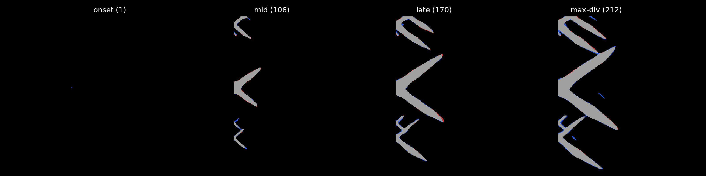
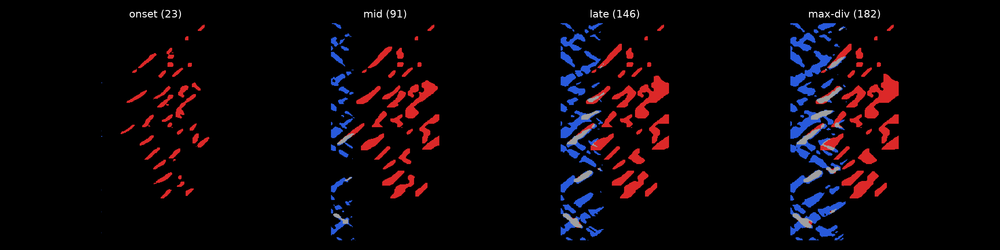
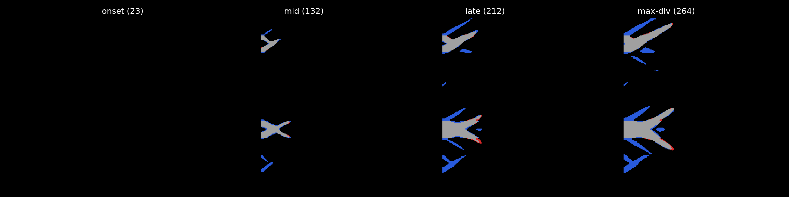

# FractureTAU Dashboard -- tau_refined

Authoritative, git-diffable static report (D-08). Regenerate with `python results/dashboard/make_report.py --run-name tau_refined`. Sections follow the locked D-14 order.

## Headline (macro F1)

Macro F1 (D-01) is the head-to-head **win claim** (per-frame F1 averaged over the rollout); micro F1 (D-02) is a labelled **secondary** column. Degenerate convention: an empty-GT frame scores 1.0 when the prediction is also empty (0/0 -> 1.0).

| Case | FractureTAU macro F1 | ConvLSTM-ref macro F1 | micro F1 (secondary) | late-rollout F1 |
|---|---:|---:|---:|---:|
| test_MS206_V100 | 0.2746 | 0.0916 | 0.0000 | 0.0000 |
| test_MS206_V1000 | 0.9318 | 0.7044 | 0.9653 | 0.9676 |
| test_MS206_V200 | 0.8901 | 0.2213 | 0.9163 | 0.9083 |
| test_MS206_V400 | 0.9104 | 0.6537 | 0.9106 | 0.8881 |
| test_MS210_V400 | 0.6993 | 0.6564 | 0.6138 | 0.5849 |
| test_MS5_V150ms_inc | 0.7746 | 0.3467 | 0.7554 | 0.8050 |
| test_MS5_V400ms | 0.8555 | 0.7410 | 0.8941 | 0.8870 |
| test_PBX1_V400_true | 0.0739 | 0.3575 | 0.1079 | 0.1707 |
| test_PBX_2_V400 | 0.2357 | 0.6993 | 0.3236 | 0.4133 |
| test_emergency_horizontal | 0.8011 | 0.7199 | 0.7868 | 0.7594 |
| test_horizontal_layers_3 | 0.8809 | 0.5864 | 0.8822 | 0.8753 |
| test_horizontal_layers_4 | 0.8985 | 0.7693 | 0.9136 | 0.9159 |
| test_inclusions_1_2 | 0.7388 | 0.6454 | 0.7724 | 0.7487 |
| test_inclusions_2_2 | 0.8082 | 0.7902 | 0.8159 | 0.8081 |
| test_inclusions_3_2 | 0.3728 | 0.7400 | 0.4947 | 0.5978 |
| test_inclusions_true_V400 | 0.2447 | 0.5044 | 0.3280 | 0.4268 |

## Rollout stability

Per-case foreground-F1 curves are resampled onto a common normalized **rollout fraction** [0, 1] grid (`np.interp`); the band is the **median + IQR (25-75%)** across cases at matched rollout fractions (OQ3/D-11) -- never absolute frame index, never mean +/- std.

## Coverage matrix (16x4)

Every canonical case x mode cell is reported explicitly; cells with no evaluation read **not yet evaluated** (D-09) rather than being dropped. Only BASE is fully regenerated in Phase 1.

| Case | BASE | SED | VON | PRESSURE |
|---|---|---|---|---|
| test_MS206_V100 | 0.0000 | not yet evaluated | not yet evaluated | not yet evaluated |
| test_MS206_V200 | 0.9163 | not yet evaluated | not yet evaluated | not yet evaluated |
| test_MS206_V400 | 0.9106 | not yet evaluated | not yet evaluated | not yet evaluated |
| test_MS206_V1000 | 0.9653 | not yet evaluated | not yet evaluated | not yet evaluated |
| test_MS210_V400 | 0.6138 | not yet evaluated | not yet evaluated | not yet evaluated |
| test_PBX1_V400_true | 0.1079 | not yet evaluated | not yet evaluated | not yet evaluated |
| test_PBX_2_V400 | 0.3236 | not yet evaluated | not yet evaluated | not yet evaluated |
| test_MS5_V150ms_inc | 0.7554 | not yet evaluated | not yet evaluated | not yet evaluated |
| test_MS5_V400ms | 0.8941 | not yet evaluated | not yet evaluated | not yet evaluated |
| test_emergency_horizontal | 0.7868 | not yet evaluated | not yet evaluated | not yet evaluated |
| test_horizontal_layers_3 | 0.8822 | not yet evaluated | not yet evaluated | not yet evaluated |
| test_horizontal_layers_4 | 0.9136 | not yet evaluated | not yet evaluated | not yet evaluated |
| test_inclusions_1_2 | 0.7724 | not yet evaluated | not yet evaluated | not yet evaluated |
| test_inclusions_2_2 | 0.8159 | not yet evaluated | not yet evaluated | not yet evaluated |
| test_inclusions_3_2 | 0.4947 | not yet evaluated | not yet evaluated | not yet evaluated |
| test_inclusions_true_V400 | 0.3280 | not yet evaluated | not yet evaluated | not yet evaluated |

## Threshold sensitivity

FractureTAU macro F1 swept over the binarization threshold on the saved probabilities (16 case(s)), no-healing applied. This is **FractureTAU-only** (OQ4): the ConvLSTM reference is pre-binarized / fixed-threshold and is never re-rolled. The threshold is reused, not recomputed -- the Phase-1 calibrated threshold (0.725) is marked (dashed).

## Qualitative panels

FP/FN overlays on a dark background: **TP gray (160,160,160)**, **FP red (220,40,40)**, **FN blue (40,90,220)** (D-14). GT and prediction are binarized from the SAME saved probabilities in one orientation (no mirror-flip; Pitfall 2). All-case panels are written under `results/diagnostics/`; a curated subset (best / worst / representative by macro F1) is embedded below.

**best: test_MS206_V1000** (macro F1 = 0.9318)

**worst: test_PBX1_V400_true** (macro F1 = 0.0739)

**representative: test_emergency_horizontal** (macro F1 = 0.8011)

