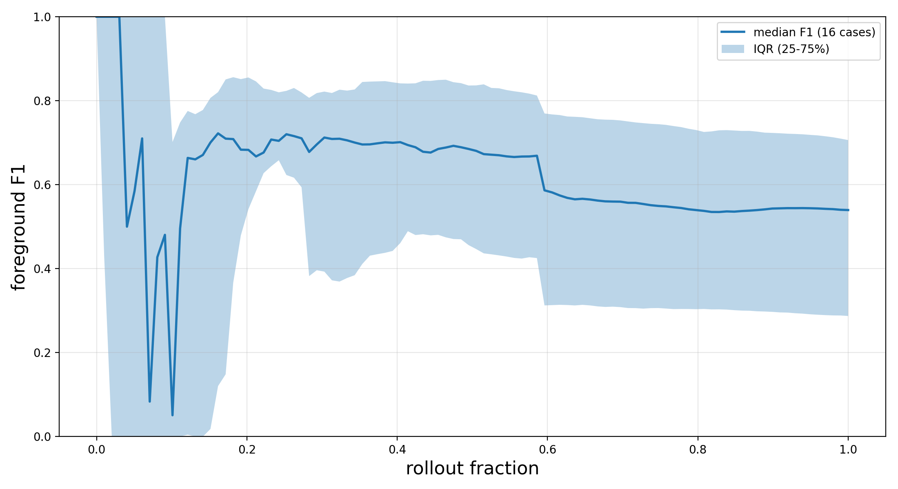
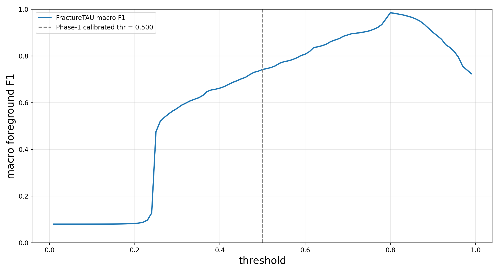
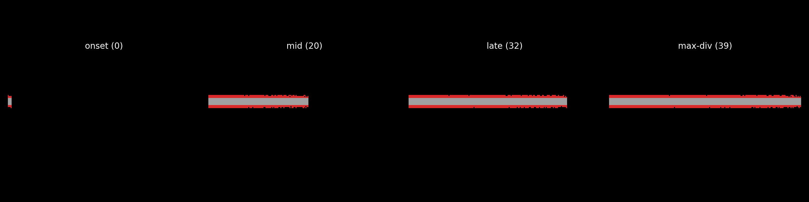
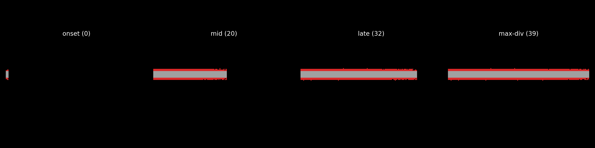

# FractureTAU Dashboard -- tau_base

Authoritative, git-diffable static report (D-08). Regenerate with `python results/dashboard/make_report.py --run-name tau_base`. Sections follow the locked D-14 order.

> **Provenance:** Headline / stability / coverage are computed from the REAL tau_base per-frame metrics (16 BASE cases). The threshold-sensitivity curve and FP/FN panels are generated from SYNTHETIC placeholder probs.npz/gt.npz (seeded) because the tau_base eval predates the Plan 02-03 raw-probability emission; a Gilbreth re-eval will replace them with real saved probs. The ConvLSTM-reference macro-F1 column reads 'not yet evaluated' until canonical-keyed reference CSVs are regenerated.

## Headline (macro F1)

Macro F1 (D-01) is the head-to-head **win claim** (per-frame F1 averaged over the rollout); micro F1 (D-02) is a labelled **secondary** column. Degenerate convention: an empty-GT frame scores 1.0 when the prediction is also empty (0/0 -> 1.0).

| Case | FractureTAU macro F1 | ConvLSTM-ref macro F1 | micro F1 (secondary) | late-rollout F1 |
|---|---:|---:|---:|---:|
| test_MS206_V100 | 0.2746 | not yet evaluated | 0.0000 | 0.0000 |
| test_MS206_V1000 | 0.7603 | not yet evaluated | 0.8033 | 0.7887 |
| test_MS206_V200 | 0.0989 | not yet evaluated | 0.0000 | 0.0000 |
| test_MS206_V400 | 0.6666 | not yet evaluated | 0.7306 | 0.6843 |
| test_MS210_V400 | 0.4852 | not yet evaluated | 0.4650 | 0.4679 |
| test_MS5_V150ms_inc | 0.5903 | not yet evaluated | 0.0000 | 0.0000 |
| test_MS5_V400ms | 0.7333 | not yet evaluated | 0.7984 | 0.7711 |
| test_PBX1_V400_true | 0.3558 | not yet evaluated | 0.3299 | 0.3305 |
| test_PBX_2_V400 | 0.1750 | not yet evaluated | 0.1904 | 0.1934 |
| test_emergency_horizontal | 0.5167 | not yet evaluated | 0.4638 | 0.4318 |
| test_horizontal_layers_3 | 0.6624 | not yet evaluated | 0.7059 | 0.7329 |
| test_horizontal_layers_4 | 0.5723 | not yet evaluated | 0.4684 | 0.4313 |
| test_inclusions_1_2 | 0.6674 | not yet evaluated | 0.6934 | 0.6901 |
| test_inclusions_2_2 | 0.7115 | not yet evaluated | 0.7414 | 0.7200 |
| test_inclusions_3_2 | 0.6563 | not yet evaluated | 0.6464 | 0.6124 |
| test_inclusions_true_V400 | 0.6926 | not yet evaluated | 0.8049 | 0.7950 |

## Rollout stability

Per-case foreground-F1 curves are resampled onto a common normalized **rollout fraction** [0, 1] grid (`np.interp`); the band is the **median + IQR (25-75%)** across cases at matched rollout fractions (OQ3/D-11) -- never absolute frame index, never mean +/- std.

## Coverage matrix (16x4)

Every canonical case x mode cell is reported explicitly; cells with no evaluation read **not yet evaluated** (D-09) rather than being dropped. Only BASE is fully regenerated in Phase 1.

| Case | BASE | SED | VON | PRESSURE |
|---|---|---|---|---|
| test_MS206_V100 | new only (0.0000) | 0.0000 | new only (0.0000) | new only (0.0000) |
| test_MS206_V200 | new only (0.0000) | 0.0000 | new only (0.0000) | new only (0.0000) |
| test_MS206_V400 | new only (0.7306) | 0.7306 | new only (0.7306) | new only (0.7306) |
| test_MS206_V1000 | new only (0.8033) | new only (0.8033) | new only (0.8033) | new only (0.8033) |
| test_MS210_V400 | new only (0.4650) | new only (0.4650) | new only (0.4650) | new only (0.4650) |
| test_PBX1_V400_true | new only (0.3299) | new only (0.3299) | new only (0.3299) | new only (0.3299) |
| test_PBX_2_V400 | new only (0.1904) | new only (0.1904) | new only (0.1904) | new only (0.1904) |
| test_MS5_V150ms_inc | new only (0.0000) | new only (0.0000) | new only (0.0000) | new only (0.0000) |
| test_MS5_V400ms | new only (0.7984) | new only (0.7984) | 0.7984 | 0.7984 |
| test_emergency_horizontal | new only (0.4638) | new only (0.4638) | new only (0.4638) | new only (0.4638) |
| test_horizontal_layers_3 | new only (0.7059) | new only (0.7059) | new only (0.7059) | new only (0.7059) |
| test_horizontal_layers_4 | new only (0.4684) | new only (0.4684) | new only (0.4684) | new only (0.4684) |
| test_inclusions_1_2 | new only (0.6934) | new only (0.6934) | new only (0.6934) | new only (0.6934) |
| test_inclusions_2_2 | new only (0.7414) | new only (0.7414) | new only (0.7414) | new only (0.7414) |
| test_inclusions_3_2 | new only (0.6464) | new only (0.6464) | new only (0.6464) | new only (0.6464) |
| test_inclusions_true_V400 | new only (0.8049) | new only (0.8049) | new only (0.8049) | new only (0.8049) |

## Threshold sensitivity

FractureTAU macro F1 swept over the binarization threshold on the saved probabilities (16 case(s)), no-healing applied. This is **FractureTAU-only** (OQ4): the ConvLSTM reference is pre-binarized / fixed-threshold and is never re-rolled. The threshold is reused, not recomputed -- the Phase-1 calibrated threshold (0.500) is marked (dashed).

## Qualitative panels

FP/FN overlays on a dark background: **TP gray (160,160,160)**, **FP red (220,40,40)**, **FN blue (40,90,220)** (D-14). GT and prediction are binarized from the SAME saved probabilities in one orientation (no mirror-flip; Pitfall 2). All-case panels are written under `results/diagnostics/`; a curated subset (best / worst / representative by macro F1) is embedded below.

**best: test_MS206_V1000** (macro F1 = 0.7603)

**worst: test_MS206_V200** (macro F1 = 0.0989)

**representative: test_inclusions_3_2** (macro F1 = 0.6563)

